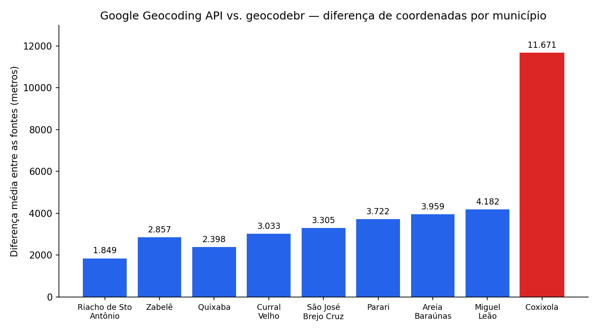

# geocoding.py

Geocodificação de endereços brasileiros com Python — do script original, usando a Google Geocoding API, até uma comparação real com o geocodebr (IPEA), testada em municípios pequenos do Nordeste.

📝 Este repositório acompanha duas publicações:
- [Geocodificação de Endereços: a melhor geotecnologia de todos os tempos da última semana](https://www.linkedin.com/pulse/geocodifica%C3%A7%C3%A3o-de-endere%C3%A7os-melhor-geotecnologia-todos-bruna-candeia/) — o script original
- [Publicação no LinkedIn](https://lnkd.in/p/etVtUUzc) comentando a ideia de comparar o resultado da Google vs. geocodebr em 9 municípios do Nordeste

## O script original: `geo.py`

Lê um arquivo `enderecos.txt` (um endereço por linha), consulta a **Google Geocoding API** via `geopy` e grava as coordenadas encontradas em `coord_finais.txt`.

```bash
pip install geopy

# Configure a chave como variável de ambiente — nunca no código
export GOOGLE_API_KEY=sua_chave_aqui          # Linux/Mac
$env:GOOGLE_API_KEY="sua_chave_aqui"          # Windows PowerShell

python 1-google-geocoding/geo.py
```

## E se eu comparasse com uma alternativa gratuita?

Há um tempo vi uma publicação da Eloísa Torlig sobre o [geocodebr](https://ipea.github.io/geocodebr/), pacote do IPEA que geocodifica endereços brasileiros usando o **CNEFE** (Cadastro Nacional de Endereços para Fins Estatísticos, do IBGE) — de graça, sem limite de consultas e sem chave de API.

Fiquei curiosa: será que ele aguenta o tranco onde a Google normalmente é mais fraca — municípios pequenos, sem volume comercial que justifique investimento? Em vez de testar em São Paulo ou no Rio, resolvi testar perto de onde nasci: comecei por **Quixaba**, município de ~1.800 habitantes no interior da Paraíba. Como a amostra de uma cidade só seria pouco conclusiva, expandi para **9 municípios de menos de 2.500 habitantes do Nordeste** (8 na Paraíba, 1 no Piauí).

### Como reproduzir o teste

Dois scripts trabalham em sequência:

```bash
pip install geopy geocodebr[geo] polars

# 1. Monta a base de teste — endereços REAIS, consultados direto no CNEFE/IBGE
python 2-comparacao-google-geocodebr/gerar_base_teste_nordeste.py
# gera: dados/enderecos_teste_nordeste.csv

# 2. Geocodifica os mesmos endereços pelas duas fontes
$env:GOOGLE_API_KEY="sua_chave_aqui"
python 2-comparacao-google-geocodebr/comparar_geocoding.py
# gera: dados/comparacao_resultados.csv

# 3. Calcula a distância real entre as duas fontes e gera o gráfico
pip install pandas matplotlib
python 2-comparacao-google-geocodebr/analisar_precisao.py
# gera: dados/precisao_resultados.csv e assets/diferenca_por_municipio.png
```

|              | Google Geocoding API          | geocodebr                 |
| ------------ | ------------------------------ | -------------------------- |
| Custo        | Paga (acima da cota gratuita) | Gratuita, sem limite       |
| Chave de API | Obrigatória                   | Não precisa                |
| Fonte        | Base comercial do Google      | CNEFE/IBGE (dado público)  |
| Cobertura    | Global                        | Brasil                     |

Os municípios testados: Quixaba, Parari, Coxixola, Riacho de Santo Antônio, Areia de Baraúnas, Zabelê, Curral Velho e São José do Brejo do Cruz (PB), e Miguel Leão (PI).

## Resultados: 135 endereços reais testados

Minha hipótese inicial era que a Google simplesmente não encontraria endereços em municípios tão pequenos. Não foi isso que aconteceu — **as duas fontes encontraram 100% dos 135 endereços**. O achado real é outro, e mais interessante: elas frequentemente discordam de **onde** o endereço fica.



| Métrica                           | Valor   |
| ---------------------------------- | ------- |
| Diferença mediana entre as fontes | 2.554 m |
| Diferença média                   | 4.108 m |
| Pares a menos de 100 m um do outro | 13%     |
| Pares a menos de 500 m            | 33%     |
| Pares a mais de 5 km de distância | 27%     |

O caso mais extremo é o que puxa a barra vermelha no gráfico: para "Rua Lucas Alexandre, Centro, Coxixola, PB", a Google retornou um ponto **98 km fora dos limites do município** — fisicamente em outra região da Paraíba. O geocodebr manteve o resultado dentro de Coxixola.

Não há um gabarito independente aqui para dizer qual fonte está certa em cada caso — só sabemos que elas discordam, e com que frequência. A exceção é justamente Coxixola: a distância, sozinha, já descarta o resultado da Google como plausível.

Faz sentido quando se pensa em incentivo: dificilmente a Google investe no mesmo nível de precisão num município de 1.800 habitantes e numa capital. O geocodebr parte do CNEFE, levantado porta a porta pelo IBGE — o Estado é obrigado a visitar, independente do tamanho do município. Fora dos grandes centros, a origem do dado pesa tanto quanto a ferramenta escolhida.

## Estrutura

```
geocoding.py/
├── 1-google-geocoding/
│   └── geo.py                        # geocodifica endereços via Google Geocoding API
│
├── 2-comparacao-google-geocodebr/
│   ├── gerar_base_teste_nordeste.py  # monta base de teste com endereços reais do CNEFE/IBGE
│   ├── comparar_geocoding.py         # compara Google API vs. geocodebr (IPEA)
│   └── analisar_precisao.py          # calcula a distância entre as duas fontes e gera o gráfico
│
├── assets/
│   └── diferenca_por_municipio.png   # gerado por analisar_precisao.py
│
└── dados/
    ├── enderecos_teste_nordeste.csv   # base de teste: 9 municípios do Nordeste
    ├── comparacao_resultados.csv      # saída gerada por comparar_geocoding.py
    └── precisao_resultados.csv        # saída gerada por analisar_precisao.py
```

## Dependências

```bash
pip install -r requirements.txt

# ou individualmente:
pip install geopy                   # script 1
pip install geocodebr[geo] polars   # script 2
pip install pandas matplotlib       # script 3
```

## Créditos e referências

- Eloísa Torlig — [publicação](https://www.linkedin.com/posts/eloisa-torlig_dadosabertos-ipea-rstats-share-7511532451274547200-GoIu/?utm_source=share&utm_medium=member_ios&rcm=ACoAACRTaMUBdvT01enCqo3uLqgcaR7R-LCym7I) que me apresentou ao geocodebr
- Pereira, R. H. M.; Herszenhut, D. et al. [geocodebr](https://ipea.github.io/geocodebr/) — IPEA, com apoio do Instituto Todos pela Saúde (ITpS), 2026
- Google Developers. [Geocoding API Overview](https://developers.google.com/maps/documentation/geocoding/start?hl=pt)
- Araújo, T. L.; Candeia, B. A. et al. [Geocodificação de endereços e espacialização de dados através do módulo Geopy/Python e do Quantum GIS](https://www.researchgate.net/publication/344082803_GEOCODIFICACAO_DE_ENDERECOS_E_ESPACIALIZACAO_DE_DADOS_ATRAVES_DO_MODULO_GEOPYPHYTON_E_DO_QUANTUM_GIS_APLICADO_AO_SISTEMA_DE_ALUNOS_INGRESSANTES_NO_IFPB_-_CAMPUS_JOAO_PESSOA_NOS_ANOS_DE_2004_2009_e_201). 2017.

---

Autora: [@bcandeia](https://github.com/bcandeia)
